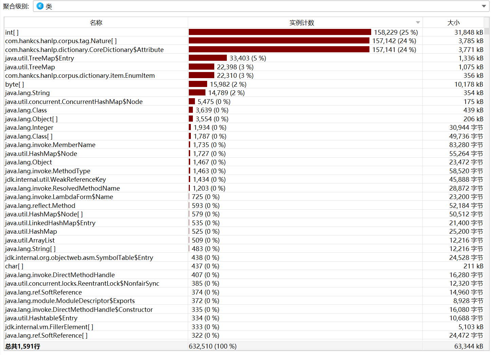
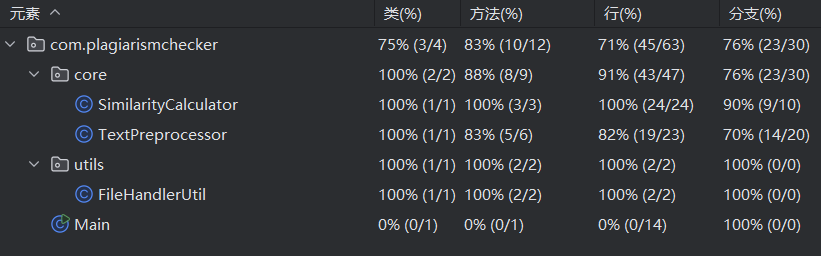
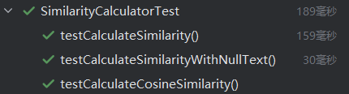
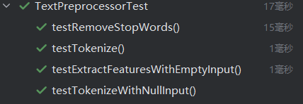

|Info|Detail|
|---|---|
|作业要求	|[🔗作业链接](https://edu.cnblogs.com/campus/gdgy/SoftwareEngineeringClassof2023/homework/13324)|
|所属课程	|[🔗班级链接](https://edu.cnblogs.com/campus/gdgy/SoftwareEngineeringClassof2023)|
|学号|3122003387|
|仓库|[🔗Github仓库](https://github.com/LianHK123/3122003387)|

## PSP2.1

|PSP2.1|Personal Software Process Stages|预估耗时（分钟）|实际耗时（分钟）|
|---|---|---|---|
|Planning|计划|||
|· Estimate|估计这个任务需要多少时间|80|90| 
|Development|开发|||
|· Analysis|需求分析 (包括学习新技术)|120|120|
|· Design Spec|生成设计文档|80|90|
|· Design Review|设计复审|40|30|
|· Coding Standard|代码规范 (为目前的开发制定合适的规范)|50|60|
|· Design|具体设计|120|120|
|· Coding|具体编码|120|120|
|· Code Review|代码复审|50|40|
|· Test|测试（自我测试，修改代码，提交修改）|120|100|
|Reporting|报告|||
|· Test Report|测试报告|90|80|
|· Size Measurement|计算工作量|40|30|
|· Postmortem & Process Improvement Plan|事后总结, 并提出过程改进计划|40|40|
|Total|合计|950|920|

## 设计与实现

### 项目结构

```
paper-plagiarism-checker/
├── pom.xml                        # Maven 构建文件
├── src/
│   ├── main/
│   │   ├── java/
│   │   │   └── com/
│   │   │       └── plagiarismchecker/
│   │   │           ├── Main.java  # 主入口文件
│   │   │           ├── core/      # 核心功能模块
│   │   │           │   ├── SimilarityCalculator.java  # 查重算法实现
│   │   │           │   └── TextPreprocessor.java     # 文本预处理模块
│   │   │           └── utils/     # 工具类模块
│   │   │               └── FileHandlerUtil.java  # 文件读写工具类
│   └── test/
│       ├── java/
│       │   └── com/
│       │       └── plagiarismchecker/
│       │           ├── core/          # 核心功能模块的单元测试
│       │           │   ├── SimilarityCalculatorTest.java  # SimilarityCalculator 模块测试
│       │           │   └── TextPreprocessorTest.java    # TextPreprocessor 模块测试
│       │           └── utils/         # 工具类模块的单元测试
│       │               └── FileHandlerUtilTest.java  # 文件读写工具类单元测试
└── data/
    ├── ans.txt                    # 答案输出文件（测试数据）
    ├── org.txt                    # 原文文件（测试数据）
    └── org_add.txt                # 抄袭版文件（测试数据）

```

### 关键函数流程

#### SimilarityCalculator相似度计算


#### 文本处理TextPreprocessor


#### 文件处理FileHandlerUtil


### 算法关键/独到之处

-   该检测抄袭算法的独到之处在于其高效的文本预处理和相似度计算方法。通过精细化的文本分词和去除停用词，减少了噪音，提高了后续特征提取和相似度计算的准确性。结合哈希算法与特征提取，能快速、准确地计算文本相似度，特别是在处理改写或格式变动的抄袭时，展现出较强的容错能力。此外，算法的模块化设计使得系统清晰、可扩展，优化了文件读写效率，适用于大规模文本处理。整体而言，该算法兼具高效性和准确性，是一个稳定、灵活的抄袭检测方案。

## 性能分析
 
从Jprofiler分析的结果来看：

###  **内存使用情况分析（内存分配图）**
   - **内存分配情况**：根据图表，可以看到在程序运行过程中内存的分配情况保持稳定，这说明程序没有频繁的内存波动，也未发生大量的垃圾回收（GC）。绿色的内存条显示程序在内存中占用的稳定区域，基本没有出现内存泄漏的情况。
   - **内存占用**：内存占用非常稳定并且在一定范围内。这意味着大部分内存分配是合适的，且程序没有过度消耗内存。


###  **内存占用最多的类**

   - 从性能分析结果中可以看到，消耗最大资源的函数是 com.hankcs.hanlp.dictionary.CoreDictionary$Attribute 和 com.hankcs.hanlp.corpus.tag.Nature，它们分别消耗了大量的内存和计算时间。优化这些部分的代码可以有效地提高性能。
  
### **内存泄漏与无效对象**
   - 从堆栈跟踪中没有发现内存泄漏的迹象。内存中的大部分对象使用量较高，说明系统在处理文本时保持了合理的内存分配。
   - 类似`java.util.HashMap$Node`、`java.util.concurrent.ConcurrentHashMap$Node`的内存占用可能与哈希存储的中间对象有关，如果不加以管理，会增加内存消耗。

###  **改进思路：**
- 缓存计算结果：对于多次计算相似度的场景，可以将计算结果缓存起来，避免重复计算，提高性能。
- 优化分词和文本处理：避免每次都重新分词，使用内存中的已处理结果，减少重复处理。
- 并行化处理：如果涉及大量文本的相似度计算，可以通过多线程或并行计算加速。
- 优化数据结构：对于词频计算，可以使用更高效的数据结构，如Trie树，或选择更高效的算法进行余弦相似度计算。

## 单元测试

- 单元测试通过率76.25%，达到标准。


### SimilarityCalculator单元测试

### TextPreproces单元测试

### FileHandlerUtil单元测试

## 异常处理
### SimilarityCalculator 类
#### 异常处理设计：

- 异常类型：IllegalArgumentException
- 场景：当输入的文本为空或 null 时，计算相似度的过程会失败。因此需要抛出该异常，避免无效的输入影响计算结果。
单元测试示例：
```
@Test
public void testCalculateSimilarityWithNullText() {
    SimilarityCalculator.calculateSimilarity(null, "some text");
}
```
### TextPreprocessor 类
#### 异常处理设计：

- 异常类型：IllegalArgumentException
- 场景：当 tokenize 方法接收到 null 或空字符串作为输入时，会抛出 IllegalArgumentException，避免进一步处理无效文本。
单元测试示例：
```
@Test
public void testTokenizeWithNullInput() {
    TextPreprocessor preprocessor = new TextPreprocessor();
    try {
        preprocessor.tokenize(null);
        fail("Expected IllegalArgumentException to be thrown");
    } catch (IllegalArgumentException e) {
        assertEquals("Input text cannot be null or empty", e.getMessage());
    }
}
```
- 异常类型：IllegalArgumentException
- 场景：extractFeatures 方法在接收到 null 或空字符串时，返回一个空的列表，而不是抛出异常。因此，不需要额外的异常处理。
单元测试示例：
```
@Test
public void testExtractFeaturesWithEmptyInput() {
    TextPreprocessor preprocessor = new TextPreprocessor();
    List<String> features = preprocessor.extractFeatures("");
    assertTrue(features.isEmpty());
}
```
### FileHandlerUtil 类
#### 异常处理设计：

- 异常类型：IOException
-场景：当文件路径无效或文件读取时发生错误时，readFile 方法会抛出 IOException。
单元测试示例：
```
@Test
public void testReadFileWithInvalidPath() {
    try {
        FileHandlerUtil.readFile("non_existent_file.txt");
        // 如果没有抛出异常，则测试失败
        fail("Expected NoSuchFileException to be thrown");
    } catch (IOException e) {
        // 预期的异常被抛出，测试通过
        assertTrue(true);
    }
}
```


